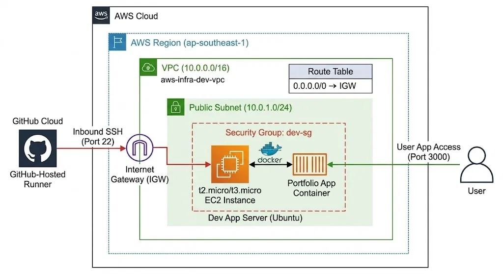
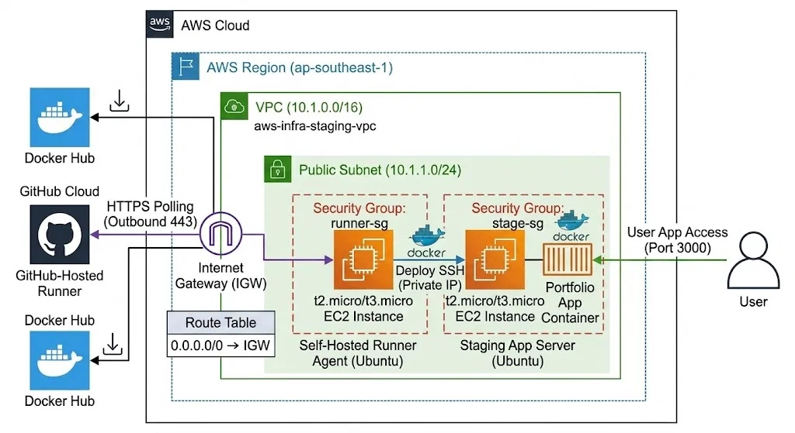

# Kanjeng Dhimas Cahyoherlina — DevOps & Security Portfolio

A personal portfolio website for **Kanjeng Dhimas Cahyoherlina**, a DevOps, Cloud Infrastructure & Security Engineer. The site showcases professional experience, technical skills, and project work across automation, cloud infrastructure, containerization, and network security — built as a fast, modern, single-codebase Next.js application.

**Focus areas:** CI/CD Automation · Cloud Infrastructure (AWS/GCP) · Containerization (Docker/Kubernetes) · Infrastructure as Code (Terraform/Ansible) · Network & Security (VPN, SIEM, Penetration Testing).

---

## 📑 Table of Contents

1. [Tech Stack](#-tech-stack)
2. [Folder Structure](#-folder-structure)
3. [Features](#-features)
4. [Installation & Deployment Guide](#-installation--deployment-guide)
5. [CI/CD & Infrastructure as Code (AWS + Terraform + GitHub Actions)](#-cicd--infrastructure-as-code-aws--terraform--github-actions)
   - [Architecture Overview](#51-architecture-overview)
   - [Prerequisites](#52-prerequisites)
   - [Create SSH Keys](#53-create-ssh-keys)
   - [Provision Development (Terraform)](#54-provision-the-development-environment-terraform)
   - [Provision Staging (Terraform)](#55-provision-the-staging-environment-terraform)
   - [Runner Method 1 — GitHub-Hosted Runner (Dev)](#56-runner-method-1--github-hosted-runner-development)
   - [Runner Method 2 — Self-Hosted Runner (Staging)](#57-runner-method-2--self-hosted-runner-staging)
   - [GitHub Environments, Secrets & Variables](#58-github-environments-secrets--variables)
   - [Branch Protection & Fork PR Safety](#59-branch-protection--fork-pr-safety)
   - [GitHub Actions Workflows](#510-github-actions-workflows)
   - [Testing the Pipeline](#511-testing-the-pipeline-end-to-end)
   - [Troubleshooting](#512-troubleshooting)
   - [Cleanup](#513-cleanup)
   - [Security Practices](#514-security-practices-applied)
6. [Contact](#-contact)

---

## 🛠 Tech Stack

| Category            | Technology                                    |
| ------------------- | --------------------------------------------- |
| Framework           | [Next.js 14](https://nextjs.org/) (App Router)|
| Language            | TypeScript                                    |
| Styling             | [Tailwind CSS](https://tailwindcss.com/)      |
| Animation           | [Framer Motion](https://www.framer.com/motion/)|
| Icons / Skill Cloud | [react-icon-cloud](https://www.npmjs.com/package/react-icon-cloud) (simple-icons) |
| Contact Form Email  | [Resend](https://resend.com/) (transactional email API) |
| Font                | [Inter](https://fonts.google.com/specimen/Inter) via `next/font` |
| Containerization    | Docker, Multi-stage Builds                    |
| Infrastructure as Code | [Terraform](https://www.terraform.io/) (AWS provider `~> 5.0`) |
| Cloud               | AWS — VPC, EC2, Elastic IP, Security Groups (region `ap-southeast-1`) |
| CI/CD               | [GitHub Actions](https://github.com/features/actions) (GitHub-hosted + Self-hosted runners) |
| Registry            | Docker Hub                                    |

---

## 📁 Folder Structure

```text
portofolio-tailwind-css/
├── .github/
│   └── workflows/
│       ├── deploy-dev.yml            # CI/CD for Development (GitHub-hosted runner)
│       └── deploy-staging.yml        # CI/CD for Staging (self-hosted runner on AWS)
│
├── image/                            # Architecture diagrams used by this README
│   ├── topologi-dev.jpg              # Development topology
│   └── topologi-staging.jpg          # Staging & Runner topology
│
├── terraform/
│   ├── .gitignore                    # Ignores state, tfvars, and private keys
│   ├── dev/
│   │   ├── main.tf                   # VPC, IGW, subnet, SG (dev-sg), key pair, EC2, EIP
│   │   ├── variables.tf              # Region, CIDRs, instance type, ports, key path
│   │   ├── outputs.tf                # Public IP, SSH command, app URL, VPC ID
│   │   ├── terraform.tfvars.example  # Template for local values
│   │   └── scripts/
│   │       └── user-data-dev.sh      # Installs Docker, Git, fail2ban on the Dev EC2
│   └── staging/
│       ├── main.tf                   # VPC, SGs (runner-sg, stage-sg), key pairs, 2x EC2, EIPs
│       ├── variables.tf              # Staging variables (developer_ip_cidr is validated)
│       ├── outputs.tf                # Runner public IP, Staging private/public IP, app URL
│       ├── terraform.tfvars.example  # Template for local values
│       └── scripts/
│           ├── user-data-runner.sh   # Docker + Buildx, swap 2 GB, "runner" user
│           └── user-data-stage.sh    # Docker on the Staging app server
│
src/
├── app/
│   ├── layout.tsx                # Root layout, global metadata & font
│   ├── page.tsx                  # Home — Hero, About, Experience marquee, Skills, Projects CTA, Contact
│   ├── globals.css               # Tailwind base layer + custom utility classes
│   ├── about/
│   │   └── page.tsx              # Dedicated About page
│   ├── skills/
│   │   └── page.tsx              # Dedicated Skills page (DevOps toolkit)
│   ├── experience/
│   │   └── page.tsx              # Dedicated Experience / career timeline page
│   ├── project/
│   │   └── page.tsx              # Dedicated Projects page (GitHub portfolio link)
│   ├── contact/
│   │   └── page.tsx              # Dedicated Contact page
│   └── backend/
│       └── api/
│           └── contact/
│               └── route.js      # API route — sends contact form submissions via Resend
│
├── components/
│   ├── Navbar.tsx                # Shared responsive navigation bar
│   ├── Footer.tsx                # Shared footer (links, social, credits)
│   ├── SocialLinks.tsx           # Shared social media icon row
│   ├── BackToTop.tsx             # Shared "scroll to top" floating button
│   ├── ContactForm.tsx           # Contact form (client component)
│   ├── SkillCategoryGrid.tsx     # Categorized skill list with tool logos
│   └── magicui/
│       ├── retro-grid.tsx        # Animated background grid
│       ├── marquee.tsx           # Infinite scrolling marquee
│       └── icon-cloud.tsx        # 3D rotating skill-logo cloud
│
├── lib/
│   └── utils.ts                  # Shared utility helpers (e.g. `cn` classnames merge)
│
├── public/
│   ├── script.js                 # Vanilla JS: navbar scroll state, hamburger menu, back-to-top
│   └── *.png / *.svg / *.gif     # Images used across the site
│
├── Dockerfile                    # Multi-stage Docker build configuration
├── docker-compose.yml            # Local container orchestration / testing
├── next.config.mjs               # Next.js configuration (Standalone output enabled)
├── package.json                  # Dependencies and npm scripts
└── postcss.config.js             # Tailwind CSS & PostCSS configuration

```

---

## ✨ Features

* **DevOps-focused personal branding** — Hero section and copywriting positioned around Automation, Cloud Infrastructure, Containerization, and Security.
* **Fully responsive, modern UI** — subtle gradients, smooth hover transitions, soft shadows, and a consistent design system built with Tailwind CSS.
* **3D interactive skill cloud** — a rotating cloud of tool logos (AWS, Docker, Kubernetes, Terraform, GitHub Actions, and more) powered by `react-icon-cloud`.
* **Categorized skills grid** — tools grouped into Cloud & Virtualization, Containerization & Orchestration, CI/CD & Automation, Networking & Security, and OS/Scripting.
* **Dedicated Experience timeline** — a clean, well-spaced career history pulled from real professional experience.
* **Live GitHub-linked project portfolio** — a direct call-to-action to browse all project source code on GitHub, instead of static screenshots that go stale.
* **Serverless contact form** — messages submitted on the site are emailed directly to the site owner's inbox via [Resend](https://resend.com/), with no database required.
* **Production-Ready Docker Support** — Highly optimized, secure (non-root user), multi-stage Dockerfile utilizing Next.js `standalone` output mode.
* **Infrastructure as Code** — two isolated AWS environments (Development and Staging) provisioned entirely with Terraform, including VPC, Security Groups, EC2 and cloud-init User Data.
* **Multi-environment CI/CD** — GitHub Actions pipelines for `dev` (GitHub-hosted runner, inbound SSH) and `main` → Staging (self-hosted runner, internal SSH over private IP), with GitHub Environments, SHA-tagged images and post-deploy health checks.

---

## 🚀 Installation & Deployment Guide

You can run this project locally using Node.js or deploy it as a production-ready Docker container.

### Prerequisites

* [Node.js](https://nodejs.org/) **v18 or newer** (For local development)
* [Docker](https://www.docker.com/) (For containerized deployment)
* A free API key from [Resend](https://resend.com/)

### 1. Clone the repository

```bash
git clone https://github.com/kanjeeng/portofolio-tailwind-css.git
cd portofolio-tailwind-css

```

### 2. Configure environment variables

Create a `.env.local` file in the project root:

```bash
cp .env.example .env.local

```

Fill in your actual values:

```env
# Get a free API key at https://resend.com
RESEND_API_KEY=re_xxxxxxxxxxxxxxxxxxxxxxxxxxxxxxxx
CONTACT_TO_EMAIL=dimasleny210@gmail.com

```

---

### 💻 Option A: Local Development (Node.js)

1. Install dependencies:
```bash
npm install

```


2. Run the development server:
```bash
npm run dev

```


3. Open [http://localhost:3000](http://localhost:3000) in your browser.

---

### 🐳 Option B: Production Deployment (Docker) - Recommended for DevOps

This project uses a multi-stage `Dockerfile` optimized for Next.js `standalone` mode, reducing the final image size and running securely as a non-root user.

**Step 1: Build the Docker Image**
Since the Contact Form API relies on environment variables during the build process, we pass them as `--build-arg`:

```bash
docker build \
  --build-arg APP_VERSION=1.0.0 \
  --build-arg RESEND_API_KEY="<YOUR_RESEND_API_KEY>" \
  --build-arg CONTACT_TO_EMAIL="dimasleny210@gmail.com" \
  -t dhimas-portofolio:latest .

```

*(Note: Replace `<YOUR_RESEND_API_KEY>` with your actual Resend API Key).*

**Step 2: Run the Docker Container**
Once the image is built, run the container in detached mode, exposing port 3000, and passing the `.env.local` file for runtime configuration:

```bash
docker run -d \
  --name portofolio-prod \
  -p 3000:3000 \
  --env-file .env.local \
  --restart unless-stopped \
  dhimas-portofolio:latest

```

**Step 3: View the Application**

* Access the site: `http://localhost:3000`
* To view logs of the running container:
```bash
docker logs -f portofolio-prod

```

> **Why the variables are needed twice:** the `builder` stage receives them as `ARG` (Next.js needs `RESEND_API_KEY` during `npm run build`), but the final `runner` stage does **not** inherit them. They must be provided again at `docker run` time (`--env-file` / `-e`) for the contact form to work. The CI/CD pipelines below do exactly this.

---

### ☁️ Option C: Deploy to Vercel

This project is also ready to deploy on [Vercel](https://vercel.com/) natively:

1. Push the repository to GitHub.
2. Import the repository into Vercel.
3. Add the same environment variables (`RESEND_API_KEY`, `CONTACT_TO_EMAIL`) under **Project Settings → Environment Variables**.
4. Deploy! Vercel will handle the Next.js builds automatically.

---

### 🏗 Option D: Automated AWS Deployment (Terraform + GitHub Actions)

Provision isolated **Development** and **Staging** environments on AWS and deploy automatically on every push. The full guide is in the next section.

---

## 🔁 CI/CD & Infrastructure as Code (AWS + Terraform + GitHub Actions)

This section documents how the portfolio is built, containerized and released to two AWS environments with different runner architectures:

| Environment | Branch trigger | Runner | How GitHub reaches the server |
|---|---|---|---|
| **Development** | push to `dev` | GitHub-hosted (`ubuntu-latest`) | **Inbound SSH** from the internet to the server's public IP |
| **Staging** | push to `main` (merge of a PR from `dev`) | **Self-hosted** runner on AWS | Runner **polls GitHub over HTTPS 443 (outbound)**, then deploys over **internal SSH to a private IP** |

### 5.1 Architecture Overview

#### A. Development topology (`terraform/dev`)



The Dev environment is a sandbox for the `dev` branch. Because the pipeline runs on GitHub's public runners (dynamic IPs), SSH (22) has to be reachable from the internet. Key-only authentication, `fail2ban`, IMDSv2 and encrypted volumes mitigate the exposure.

| Component | Configuration | Function |
|---|---|---|
| VPC & Subnet | VPC `10.0.0.0/16` (`aws-infra-dev-vpc`), public subnet `10.0.1.0/24` | Standalone environment, not connected to Staging |
| Route Table | `0.0.0.0/0 → Internet Gateway` | Makes the subnet public |
| EC2 | Ubuntu Server 22.04 LTS, `t3.micro` (or `t2.micro`), gp3 encrypted root volume, IMDSv2 required | Docker host for the portfolio container |
| Elastic IP | Static public IP | Keeps the `SSH_HOST` variable stable |
| Security Group `dev-sg` | Inbound **TCP 22** (SSH, `0.0.0.0/0` by default), **TCP 3000** (app); outbound all | GitHub runner deploys via SSH; users reach the app |
| User Data | `scripts/user-data-dev.sh` | APT update, Docker Engine + Compose plugin, Git, fail2ban |

#### B. Staging & Runner topology (`terraform/staging`)



Staging mirrors production. GitHub **never** connects into the network: the self-hosted runner pulls jobs over outbound HTTPS, builds the image locally, pushes it to Docker Hub and then SSHes to the Staging server using its **private IP**.

| Component | Configuration | Function |
|---|---|---|
| VPC & Subnet | VPC `10.1.0.0/16` (`aws-infra-staging-vpc`), public subnet `10.1.1.0/24` | Isolated from Development |
| EC2 #1 — Runner | Ubuntu 22.04, `t3.micro`, 25 GiB volume, 2 GB swap | Runs the GitHub Actions agent, builds images |
| EC2 #2 — App server | Ubuntu 22.04, `t3.micro`, 20 GiB volume | Final deployment target |
| `runner-sg` | In: TCP 22 **only from the developer IP**. Out: TCP 443, TCP 80 (APT mirrors), TCP 22 → `stage-sg` | Reaches GitHub/Docker Hub, deploys to Staging |
| `stage-sg` | In: TCP 22 **only from `runner-sg`**, TCP 3000 (app). Out: all | SSH is closed to the internet |
| Key pairs | `runner-key` (developer → runner), `deploy-key` (runner → staging) | Limits the blast radius of a leaked key |
| User Data | `user-data-runner.sh`, `user-data-stage.sh` | Docker (+ Buildx, swap and `runner` user on the runner) |

> **Note — two small differences from a minimal design:** `runner-sg` needs outbound **TCP 22 → `stage-sg`** because the runner must SSH to the app server, and outbound **TCP 80** because Ubuntu APT mirrors use HTTP.

#### How the two deployment flows differ

```text
DEVELOPMENT (Inbound SSH)
 git push dev ─► GitHub-hosted runner ─► build ─► Docker Hub (dev, dev-<sha7>)
                         │
                         └── SSH (inbound, port 22, public IP) ─► Dev EC2 ─► docker run

STAGING (Outbound polling + internal SSH)
 PR dev → main (merge) ─► GitHub queues job
 Self-hosted runner (in VPC) ◄── HTTPS 443 polling (outbound) ── GitHub
 Runner: build locally ─► Docker Hub (staging, staging-<sha7>)
 Runner ── SSH (private IP 10.1.1.x) ─► Staging EC2 ─► docker run
```

### 5.2 Prerequisites

| Requirement | Notes |
|---|---|
| AWS account | IAM user with EC2, VPC and Elastic IP permissions. Run `aws configure` with region `ap-southeast-1` |
| [Terraform](https://developer.hashicorp.com/terraform/install) | `>= 1.5.0` |
| Docker Hub account | A public repository `portofolio-tailwind-css` and a **Personal Access Token** |
| Resend account | An API key (use separate keys for Dev and Staging) |
| GitHub repository | Admin rights (Environments, Runners, Rulesets) |
| Local tools | Git, OpenSSH client, `curl` |

**Docker Hub token:** *Account Settings → Personal access tokens → Generate new token* (Read, Write, Delete) → keep it as `DOCKERHUB_TOKEN`.

**Resend API key:** create it in the Resend dashboard → keep it as `RESEND_API_KEY`.

### 5.3 Create SSH Keys

Private keys are generated **locally** and never by Terraform, so they are never stored in the Terraform state. Only the public keys are given to AWS.

```bash
# Dev server key (used by GitHub Actions)
ssh-keygen -t ed25519 -f ~/.ssh/aws-infra-dev -C "github-actions-dev" -N ""

# Developer -> Runner (Staging)
ssh-keygen -t ed25519 -f ~/.ssh/aws-infra-staging-runner -C "developer-to-runner" -N ""

# Deploy key: Runner -> Staging app server (private key goes into a GitHub Secret)
ssh-keygen -t ed25519 -f ~/.ssh/aws-infra-staging-deploy -C "runner-to-staging" -N ""
```

Get your public IP (needed for `runner-sg`):

```bash
curl -s https://checkip.amazonaws.com
```

### 5.4 Provision the Development Environment (Terraform)

```bash
cd terraform/dev
cp terraform.tfvars.example terraform.tfvars
# Adjust public_key_path (use the absolute path on Windows if needed)

terraform init
terraform fmt -check
terraform validate
terraform plan -out=tfplan
terraform apply tfplan
```

Take note of the outputs:

| Output | Used for |
|---|---|
| `dev_public_ip` | `SSH_HOST` variable in the **Development** environment |
| `dev_app_url` | Opening the Dev site (`http://<ip>:3000`) |
| `dev_ssh_command` | Logging in to the server |

Verify the User Data finished:

```bash
ssh -i ~/.ssh/aws-infra-dev ubuntu@<dev_public_ip>
cloud-init status --wait     # expected: status: done
docker --version
docker ps
```

### 5.5 Provision the Staging Environment (Terraform)

```bash
cd terraform/staging
cp terraform.tfvars.example terraform.tfvars
# Edit developer_ip_cidr, e.g. "203.0.113.10/32" (0.0.0.0/0 is rejected by validation)

terraform init
terraform fmt -check
terraform validate
terraform plan -out=tfplan
terraform apply tfplan
```

Take note of the outputs:

| Output | Used for |
|---|---|
| `runner_public_ip` | SSH into the runner to install the agent |
| `stage_private_ip` | `SSH_HOST` variable in the **Staging** environment (**private IP**, e.g. `10.1.1.x`) |
| `stage_public_ip` / `stage_app_url` | Opening the Staging site |

**Security verification (recommended):**

```bash
# From your laptop: must FAIL (timeout) — port 22 of stage-sg is closed to the internet
ssh -i ~/.ssh/aws-infra-staging-deploy ubuntu@<stage_public_ip>

# From the Runner: must SUCCEED over the private IP
ssh -i ~/.ssh/aws-infra-staging-runner ubuntu@<runner_public_ip>
#   inside the runner, temporarily create the deploy key, test, then delete it:
nano /tmp/deploy_key && chmod 600 /tmp/deploy_key
ssh -i /tmp/deploy_key ubuntu@<stage_private_ip> docker --version
rm /tmp/deploy_key
```

### 5.6 Runner Method 1 — GitHub-Hosted Runner (Development)

With this method **nothing has to be installed or registered**: GitHub provides a fresh `ubuntu-latest` virtual machine for every run. The runner connects *to your server* over SSH, so the Dev server must accept inbound SSH.

**Complete setup steps**

1. **Provision the Dev infrastructure** — follow [5.4](#54-provision-the-development-environment-terraform). `dev-sg` allows TCP 22 and TCP 3000.
2. **Create the `Development` environment** and restrict it to the `dev` branch — see [5.8](#58-github-environments-secrets--variables).
3. **Add the private key** `~/.ssh/aws-infra-dev` as the `SSH_PRIVATE_KEY` secret and set `SSH_HOST` to `dev_public_ip`.
4. **Add the remaining secrets/variables** (Docker Hub, Resend, container name, port).
5. **Make sure the workflow uses the GitHub-hosted label:**

   ```yaml
   runs-on: ubuntu-latest
   environment: Development
   ```

6. **Push to `dev`** to trigger the pipeline:

   ```bash
   git checkout -b dev
   git add .github/workflows terraform
   git commit -m "ci: add terraform and CI/CD workflows"
   git push -u origin dev
   ```

7. **What happens on every push to `dev`:**
   1. GitHub starts an `ubuntu-latest` VM and checks out the code.
   2. The image is built with Docker Buildx (cache `type=gha`) and pushed to Docker Hub as `:dev` and `:dev-<sha7>`.
   3. The GitHub runner opens an **inbound SSH** connection to the Dev server's public IP using `SSH_PRIVATE_KEY`.
   4. The server pulls `:dev-<sha7>`, replaces the old container and passes `RESEND_API_KEY` / `CONTACT_TO_EMAIL` at runtime.
   5. A health check calls `http://localhost:3000` up to 15 times; the job fails (and prints container logs) if the app is not healthy.

8. **Verify:**

   ```bash
   curl -I http://<dev_public_ip>:3000          # expect HTTP/1.1 200 OK
   ssh -i ~/.ssh/aws-infra-dev ubuntu@<dev_public_ip> "docker ps --filter name=portofolio-dev"
   ```

> **Trade-off:** GitHub-hosted runners use dynamic IP ranges, so SSH cannot be restricted to a fixed CIDR. Compensating controls: key-only authentication, `fail2ban`, IMDSv2, encrypted EBS and environment-scoped secrets.

### 5.7 Runner Method 2 — Self-Hosted Runner (Staging)

With this method GitHub **never connects into your network**. An agent running on your own EC2 instance polls GitHub over outbound HTTPS (443), takes the job, builds the image locally and deploys to the Staging server through its private IP.

The runner EC2 is prepared by `user-data-runner.sh` (Docker + Buildx, dependencies, 2 GB swap, non-root user `runner`). The **registration token is short-lived (~1 hour)**, so registration is done manually.

**Complete setup steps**

1. **Provision the Staging infrastructure** — follow [5.5](#55-provision-the-staging-environment-terraform).

2. **Generate a registration token:** repository → *Settings → Actions → Runners → New self-hosted runner* → choose **Linux** and **x64** → copy the token.

3. **SSH into the runner and confirm User Data finished:**

   ```bash
   ssh -i ~/.ssh/aws-infra-staging-runner ubuntu@<runner_public_ip>
   cloud-init status --wait
   docker --version
   free -h                      # confirm 2 GB swap is active
   ```

4. **Switch to the `runner` user and download the latest agent:**

   ```bash
   sudo -iu runner
   cd ~/actions-runner

   RUNNER_VERSION=$(curl -fsSL https://api.github.com/repos/actions/runner/releases/latest | jq -r '.tag_name' | sed 's/^v//')
   curl -fsSLO "https://github.com/actions/runner/releases/download/v${RUNNER_VERSION}/actions-runner-linux-x64-${RUNNER_VERSION}.tar.gz"
   tar xzf "actions-runner-linux-x64-${RUNNER_VERSION}.tar.gz"
   ```

   *(Alternatively, use the exact version shown on the GitHub "New self-hosted runner" page.)*

5. **Bind the agent to the repository** and set the `staging` label (used by `runs-on`):

   ```bash
   ./config.sh \
     --url https://github.com/kanjeeng/portofolio-tailwind-css \
     --token <REGISTRATION_TOKEN> \
     --name runner-staging-01 \
     --labels staging \
     --unattended
   ```

6. **Install it as a `systemd` service** so it starts on boot and always stays `Idle` for new jobs:

   ```bash
   exit                                   # back to the ubuntu user
   cd /home/runner/actions-runner
   sudo ./svc.sh install runner
   sudo ./svc.sh start
   sudo ./svc.sh status
   ```

7. **Verify in GitHub:** *Settings → Actions → Runners* must show `runner-staging-01` as **Idle** with labels `self-hosted`, `Linux`, `X64`, `staging`.

8. **Make the workflow target it:**

   ```yaml
   runs-on: [self-hosted, linux, staging]
   environment: Staging
   ```

9. **Create the `Staging` environment** restricted to `main` and add its secrets/variables — see [5.8](#58-github-environments-secrets--variables). `SSH_HOST` must be the **private IP** (`stage_private_ip`) and `SSH_PRIVATE_KEY` must be the **deploy key** (`~/.ssh/aws-infra-staging-deploy`).

10. **Trigger it:** open a Pull Request from `dev` to `main` and merge it. If *Required reviewers* is enabled on the `Staging` environment, open the workflow run → **Review deployments** → select *Staging* → **Approve and deploy**.

11. **What happens on every merge to `main`:**
    1. The runner (status changes from *Idle* to *Active*) picks up the queued job through outbound HTTPS.
    2. It checks out the code and builds the image locally (Docker layer cache stays on the runner).
    3. The image is pushed to Docker Hub as `:staging` and `:staging-<sha7>`.
    4. The runner SSHes to `SSH_HOST` (**private IP**) — allowed only because `stage-sg` trusts `runner-sg`.
    5. The server pulls the image, swaps the container, passes the runtime variables and runs the health check.
    6. A cleanup step prunes build cache older than 7 days to protect the EBS volume.

12. **Verify:**

    ```bash
    curl -I http://<stage_public_ip>:3000        # expect HTTP/1.1 200 OK
    ```

**Useful runner commands**

```bash
sudo ./svc.sh status                         # service state
sudo ./svc.sh stop && sudo ./svc.sh start    # restart the agent
sudo journalctl -u 'actions.runner.*' -f     # live runner logs
```

### 5.8 GitHub Environments, Secrets & Variables

Go to **Settings → Environments → New environment** and create two environments. The names must match the `environment:` value in the workflows exactly.

| Environment | *Deployment branches and tags* | Optional |
|---|---|---|
| `Development` | *Selected branches and tags* → add rule `dev` | — |
| `Staging` | *Selected branches and tags* → add rule `main` | Enable **Required reviewers** for a manual approval gate |

Sensitive values are **Secrets**; non-sensitive configuration is stored as **Variables**.

#### Environment `Development`

| Type | Name | Value | Notes |
|---|---|---|---|
| Secret | `DOCKERHUB_TOKEN` | Docker Hub access token | Used by `docker/login-action` |
| Secret | `SSH_PRIVATE_KEY` | Full content of `~/.ssh/aws-infra-dev` | Include the `BEGIN`/`END` lines |
| Secret | `RESEND_API_KEY` | Resend API key | Build-arg and runtime |
| Variable | `DOCKERHUB_USERNAME` | Docker Hub username | Builds the image name |
| Variable | `IMAGE_NAME` | `portofolio-tailwind-css` | Image repository name |
| Variable | `SSH_HOST` | Output `dev_public_ip` | Elastic IP of the Dev server |
| Variable | `SSH_USER` | `ubuntu` | Default Ubuntu AMI user |
| Variable | `CONTAINER_NAME` | `portofolio-dev` | Container name |
| Variable | `APP_PORT` | `3000` | Host port |
| Variable | `CONTACT_TO_EMAIL` | `dimasleny210@gmail.com` | Contact form recipient |

#### Environment `Staging`

| Type | Name | Value | Notes |
|---|---|---|---|
| Secret | `DOCKERHUB_TOKEN` | Docker Hub access token | May be the same as Dev |
| Secret | `SSH_PRIVATE_KEY` | Full content of `~/.ssh/aws-infra-staging-deploy` | Runner → Staging deploy key |
| Secret | `RESEND_API_KEY` | Resend API key | A separate key from Dev is recommended |
| Variable | `DOCKERHUB_USERNAME` | Docker Hub username | |
| Variable | `IMAGE_NAME` | `portofolio-tailwind-css` | |
| Variable | `SSH_HOST` | Output `stage_private_ip` | **Private IP**, e.g. `10.1.1.x` |
| Variable | `SSH_USER` | `ubuntu` | |
| Variable | `CONTAINER_NAME` | `portofolio-staging` | |
| Variable | `APP_PORT` | `3000` | |
| Variable | `CONTACT_TO_EMAIL` | `dimasleny210@gmail.com` | |

Copy the private keys exactly as printed:

```bash
cat ~/.ssh/aws-infra-dev               # -> Development / SSH_PRIVATE_KEY
cat ~/.ssh/aws-infra-staging-deploy    # -> Staging / SSH_PRIVATE_KEY
```

### 5.9 Branch Protection & Fork PR Safety

**Protect `main`** — *Settings → Rules → Rulesets → New branch ruleset*:

1. Ruleset name `protect-main`, **Enforcement status: Active**.
2. **Target branches:** `main`.
3. Enable **Restrict deletions**, **Require a pull request before merging** and **Block force pushes**.
4. Click **Create**.

Direct pushes to `main` are now blocked, so a Staging deployment only happens after a Pull Request from `dev` is approved and merged.

**Fork pull request safety (important for public repositories with a self-hosted runner)** — *Settings → Actions → General → Fork pull request workflows from outside collaborators* → select **Require approval for all outside collaborators** (or at least *first-time contributors*). Also keep the Staging workflow triggers limited to the safe set below, **never `pull_request`**:

```yaml
on:
  push:
    branches:
      - main
  workflow_dispatch:
```

### 5.10 GitHub Actions Workflows

Improvements over a basic pipeline:

| Aspect | Basic example | These workflows |
|---|---|---|
| SSH action version | `appleboy/ssh-action@master` | Pinned `@v1.2.0` (supply-chain safety) |
| Secrets in scripts | Interpolated `${{ secrets.X }}` into script text | Passed through `envs:` as environment variables |
| Image tags | `latest` only | `dev` / `staging` **plus** `<env>-<sha7>` (traceability, rollback) |
| Build cache | `no-cache: true` | `type=gha` (Dev) / local Docker daemon cache (Staging) |
| Cleanup | `docker system prune -f` | `docker image prune -f` (safe) |
| Verification | none | Health check with 15 retries; logs printed on failure |
| Token scope | default | `permissions: contents: read` |
| Concurrency | none | One deployment per environment at a time |
| Docker login | `echo … \| docker login` | `docker/login-action@v3` |

<details>
<summary><b>📄 .github/workflows/deploy-dev.yml</b> (GitHub-hosted runner)</summary>

```yaml
name: 🚀 CI/CD Dev (GitHub-Hosted Runner)

on:
  push:
    branches:
      - dev
  workflow_dispatch:

# One Dev deployment at a time; never cancel a deployment in progress
concurrency:
  group: deploy-dev
  cancel-in-progress: false

# Least privilege for GITHUB_TOKEN
permissions:
  contents: read

jobs:
  build-and-deploy:
    name: Build, Push & Deploy (Dev)
    runs-on: ubuntu-latest
    environment: Development # Secrets & Variables come from the "Development" environment
    timeout-minutes: 30

    steps:
      - name: 📦 Checkout Code
        uses: actions/checkout@v4

      - name: 🏷 Tentukan Metadata Build
        id: meta
        run: |
          echo "short_sha=${GITHUB_SHA::7}" >> "$GITHUB_OUTPUT"
          echo "image=${{ vars.DOCKERHUB_USERNAME }}/${{ vars.IMAGE_NAME }}" >> "$GITHUB_OUTPUT"

      - name: 🧰 Setup Docker Buildx
        uses: docker/setup-buildx-action@v3

      - name: 🔐 Login ke Docker Hub
        uses: docker/login-action@v3
        with:
          username: ${{ vars.DOCKERHUB_USERNAME }}
          password: ${{ secrets.DOCKERHUB_TOKEN }}

      - name: "🛠 Build dan Push Image (tag: dev)"
        uses: docker/build-push-action@v6
        with:
          context: .
          push: true
          tags: |
            ${{ steps.meta.outputs.image }}:dev
            ${{ steps.meta.outputs.image }}:dev-${{ steps.meta.outputs.short_sha }}
          build-args: |
            RESEND_API_KEY=${{ secrets.RESEND_API_KEY }}
            CONTACT_TO_EMAIL=${{ vars.CONTACT_TO_EMAIL }}
            APP_VERSION=dev-${{ steps.meta.outputs.short_sha }}
          cache-from: type=gha
          cache-to: type=gha,mode=max

      - name: 🚢 Deploy ke Server Dev via SSH (Inbound)
        uses: appleboy/ssh-action@v1.2.0
        env:
          IMAGE: ${{ steps.meta.outputs.image }}:dev-${{ steps.meta.outputs.short_sha }}
          CONTAINER_NAME: ${{ vars.CONTAINER_NAME }}
          APP_PORT: ${{ vars.APP_PORT }}
          CONTACT_TO_EMAIL: ${{ vars.CONTACT_TO_EMAIL }}
          RESEND_API_KEY: ${{ secrets.RESEND_API_KEY }}
        with:
          host: ${{ vars.SSH_HOST }}
          username: ${{ vars.SSH_USER }}
          key: ${{ secrets.SSH_PRIVATE_KEY }}
          port: 22
          timeout: 60s
          command_timeout: 10m
          script_stop: true
          # Secrets are sent as environment variables, not interpolated into the script text
          envs: IMAGE,CONTAINER_NAME,APP_PORT,CONTACT_TO_EMAIL,RESEND_API_KEY
          script: |
            echo "🔁 Menarik image: $IMAGE"
            docker pull "$IMAGE"

            echo "🛑 Menghentikan container lama (jika ada)..."
            docker stop "$CONTAINER_NAME" || true
            docker rm "$CONTAINER_NAME" || true

            echo "🚀 Menjalankan container baru..."
            docker run -d \
              --name "$CONTAINER_NAME" \
              --restart unless-stopped \
              -p "${APP_PORT}:3000" \
              -e NODE_ENV=production \
              -e PORT=3000 \
              -e RESEND_API_KEY \
              -e CONTACT_TO_EMAIL \
              "$IMAGE"

            echo "🩺 Health check..."
            for i in $(seq 1 15); do
              if curl -fsS "http://localhost:${APP_PORT}" > /dev/null; then
                echo "✅ Aplikasi sehat (percobaan ke-$i)"
                docker image prune -f
                exit 0
              fi
              sleep 4
            done

            echo "❌ Health check gagal. Log container:"
            docker logs --tail 50 "$CONTAINER_NAME"
            exit 1
```

</details>

<details>
<summary><b>📄 .github/workflows/deploy-staging.yml</b> (self-hosted runner)</summary>

```yaml
name: 🚀 CI/CD Staging (Self-Hosted Runner)

# Merging a Pull Request dev -> main produces a push event on main
on:
  push:
    branches:
      - main
  workflow_dispatch:

concurrency:
  group: deploy-staging
  cancel-in-progress: false

permissions:
  contents: read

jobs:
  build-and-deploy:
    name: Build, Push & Deploy (Staging)
    # Executed by our own runner agent inside the Staging VPC on AWS
    runs-on: [self-hosted, linux, staging]
    environment: Staging # Secrets & Variables come from the "Staging" environment
    timeout-minutes: 45

    steps:
      - name: 📦 Checkout Code
        uses: actions/checkout@v4

      - name: 🏷 Tentukan Metadata Build
        id: meta
        run: |
          echo "short_sha=${GITHUB_SHA::7}" >> "$GITHUB_OUTPUT"
          echo "image=${{ vars.DOCKERHUB_USERNAME }}/${{ vars.IMAGE_NAME }}" >> "$GITHUB_OUTPUT"

      - name: 🔐 Login ke Docker Hub
        uses: docker/login-action@v3
        with:
          username: ${{ vars.DOCKERHUB_USERNAME }}
          password: ${{ secrets.DOCKERHUB_TOKEN }}

      # Built locally on the Runner; layer cache lives in the Runner's Docker daemon
      - name: "🛠 Build dan Push Image (tag: staging)"
        uses: docker/build-push-action@v6
        with:
          context: .
          push: true
          tags: |
            ${{ steps.meta.outputs.image }}:staging
            ${{ steps.meta.outputs.image }}:staging-${{ steps.meta.outputs.short_sha }}
          build-args: |
            RESEND_API_KEY=${{ secrets.RESEND_API_KEY }}
            CONTACT_TO_EMAIL=${{ vars.CONTACT_TO_EMAIL }}
            APP_VERSION=staging-${{ steps.meta.outputs.short_sha }}

      - name: 🚢 Deploy ke Server Staging via SSH Internal (IP Privat)
        uses: appleboy/ssh-action@v1.2.0
        env:
          IMAGE: ${{ steps.meta.outputs.image }}:staging-${{ steps.meta.outputs.short_sha }}
          CONTAINER_NAME: ${{ vars.CONTAINER_NAME }}
          APP_PORT: ${{ vars.APP_PORT }}
          CONTACT_TO_EMAIL: ${{ vars.CONTACT_TO_EMAIL }}
          RESEND_API_KEY: ${{ secrets.RESEND_API_KEY }}
        with:
          host: ${{ vars.SSH_HOST }} # PRIVATE IP of the Staging server, e.g. 10.1.1.x
          username: ${{ vars.SSH_USER }}
          key: ${{ secrets.SSH_PRIVATE_KEY }}
          port: 22
          timeout: 60s
          command_timeout: 10m
          script_stop: true
          envs: IMAGE,CONTAINER_NAME,APP_PORT,CONTACT_TO_EMAIL,RESEND_API_KEY
          script: |
            echo "🔁 Menarik image: $IMAGE"
            docker pull "$IMAGE"

            echo "🛑 Menghentikan container lama (jika ada)..."
            docker stop "$CONTAINER_NAME" || true
            docker rm "$CONTAINER_NAME" || true

            echo "🚀 Menjalankan container baru..."
            docker run -d \
              --name "$CONTAINER_NAME" \
              --restart unless-stopped \
              -p "${APP_PORT}:3000" \
              -e NODE_ENV=production \
              -e PORT=3000 \
              -e RESEND_API_KEY \
              -e CONTACT_TO_EMAIL \
              "$IMAGE"

            echo "🩺 Health check..."
            for i in $(seq 1 15); do
              if curl -fsS "http://localhost:${APP_PORT}" > /dev/null; then
                echo "✅ Aplikasi sehat (percobaan ke-$i)"
                docker image prune -f
                exit 0
              fi
              sleep 4
            done

            echo "❌ Health check gagal. Log container:"
            docker logs --tail 50 "$CONTAINER_NAME"
            exit 1

      - name: 🧹 Bersihkan Cache Build di Runner
        if: always()
        run: docker builder prune -f --filter "until=168h" || true
```

</details>

### 5.11 Testing the Pipeline End to End

1. **Push to `dev`** (see [5.6](#56-runner-method-1--github-hosted-runner-development)). In the **Actions** tab the *CI/CD Dev* workflow must finish green.
   ```bash
   curl -I http://<dev_public_ip>:3000
   ssh -i ~/.ssh/aws-infra-dev ubuntu@<dev_public_ip> "docker ps --filter name=portofolio-dev"
   ```
2. **Promote to Staging:** open a Pull Request `dev` → `main`, review, **Merge pull request** → **Confirm merge**. Approve the deployment if reviewers are required. Watch the runner switch from *Idle* to *Active*.
   ```bash
   curl -I http://<stage_public_ip>:3000
   ```
3. **Test the contact form:** open `http://<stage_public_ip>:3000/contact`, send a message and confirm the email arrives at `CONTACT_TO_EMAIL`. This proves that both the build-arg and the runtime variables reached the container.
4. **Test branch restriction:** run the Dev workflow manually (`workflow_dispatch`) from a branch other than `dev`; it must be rejected by *Deployment branches and tags*.
5. **Test rollback:** redeploy an older immutable tag on the target server:
   ```bash
   docker pull <dockerhub-user>/portofolio-tailwind-css:staging-<old-sha7>
   docker rm -f portofolio-staging
   docker run -d --name portofolio-staging --restart unless-stopped -p 3000:3000 \
     -e NODE_ENV=production -e PORT=3000 \
     -e RESEND_API_KEY="<key>" -e CONTACT_TO_EMAIL="dimasleny210@gmail.com" \
     <dockerhub-user>/portofolio-tailwind-css:staging-<old-sha7>
   ```

### 5.12 Troubleshooting

| Symptom | Likely cause | Fix |
|---|---|---|
| `Permission denied (publickey)` during deploy | `SSH_PRIVATE_KEY` incomplete or not matching the EC2 key pair | Re-paste the whole key including `BEGIN`/`END` lines; use the right key per environment |
| SSH `i/o timeout` on Dev | `dev-sg` not open on 22, or wrong `SSH_HOST` | Check the Security Group and `dev_public_ip` |
| SSH `i/o timeout` on Staging | `SSH_HOST` is the public IP, or `runner-sg` lacks egress 22 | Use `stage_private_ip`; verify SG rules |
| Job stuck on *Waiting for a runner* | Runner offline or label mismatch | `sudo ./svc.sh status`; confirm label `staging` |
| Build fails with `Killed` / exit code 137 | Out of memory on a 1 GB instance | Confirm swap with `free -h`, or use `t3.small` |
| Resend error during `next build` | `RESEND_API_KEY` build-arg empty | Check the secret name in the correct environment |
| Contact form fails after deploy | Runtime variables missing | Ensure `-e RESEND_API_KEY` and `envs:` are present |
| Job rejected: *not allowed to deploy* | Branch not allowed by the environment rule | Fix *Deployment branches and tags* |
| Docker `permission denied` on the runner | `runner` user not in the `docker` group | `sudo usermod -aG docker runner`, then `sudo ./svc.sh stop && sudo ./svc.sh start` |
| `docker pull` rate limit | Anonymous Docker Hub pulls | Add a `docker login` step in the deploy script or use an authenticated account |
| `terraform apply` cannot read the key | Wrong `public_key_path` | Use the absolute path to the `.pub` file |

Logs: User Data → `/var/log/user-data.log`; runner service → `sudo journalctl -u 'actions.runner.*' -f`.

### 5.13 Cleanup

Avoid unnecessary costs (EC2, Elastic IP, EBS). Remove the runner from GitHub first (*Settings → Actions → Runners → Remove*), then destroy both stacks:

```bash
cd terraform/staging && terraform destroy
cd ../dev && terraform destroy
```

### 5.14 Security Practices Applied

| Area | Implementation |
|---|---|
| Isolation | Two separate VPCs (`10.0.0.0/16`, `10.1.0.0/16`) with no peering |
| SSH access | ed25519 keys, no password login, private keys never in Terraform state, separate developer and deploy keys |
| Staging | App-server port 22 only from `runner-sg`; runner reachable only from the developer IP (validated, `0.0.0.0/0` rejected) |
| Dev mitigations | `fail2ban`, IMDSv2, encrypted volumes (SSH must be open broadly) |
| Secrets | Environment secrets, scoped to branches, passed through `envs:` |
| Supply chain | Actions pinned to versions, no `@master` |
| Releases | SHA-based tags, health checks, optional approval gate on Staging |
| Repository | Ruleset on `main` (PR required, no force push), fork-PR approval for self-hosted runner safety |
| Cost | `t3.micro` instances, Elastic IPs, teardown with `terraform destroy` |

**Next steps:** move Terraform state to a remote backend (S3 with state locking), rotate SSH keys / Docker Hub tokens / API keys regularly, add monitoring (CloudWatch, Prometheus/Grafana), schedule EBS snapshots, and use a private registry if the image must not be public.

---

## 📬 Contact

* **Email:** dimasleny210@gmail.com
* **GitHub:** [github.com/kanjeeng](https://github.com/kanjeeng)
* **LinkedIn:** [Kanjeng Dhimas Cahyoherlina](https://www.linkedin.com/in/kanjeng-dhimas-cahyoherlina-249155197/)

---